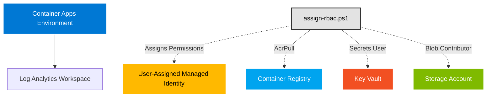

# Eklee KeyVault Infrastructure Deployment

This folder contains the infrastructure as code (IaC) for deploying the Eklee KeyVault application to Azure using Bicep.

## 📋 Overview

The infrastructure includes:

- **Azure Container Apps Environment** - Managed serverless container hosting
- **User-Assigned Managed Identity** - For future Container App authentication
- **Azure Storage Account** - For application data and blob storage
- **Azure Key Vault** - For secure secrets and key management
- **Log Analytics Workspace** - For application monitoring and logging
- **RBAC Role Assignments** - Managed via separate PowerShell script (`assign-rbac.ps1`)

## 🏗️ Architecture



> **Note:** This deployment prepares the infrastructure foundation. RBAC roles are assigned via the `assign-rbac.ps1` script after deployment. The Container App itself will be deployed separately using the pre-configured managed identity.

## 📂 Files

| File | Description |
|------|-------------|
| `main.bicep` | Main infrastructure template |
| `assign-rbac.ps1` | RBAC role assignment script (run after deployment) |
| `README.md` | This file |

## 🚀 Prerequisites

Before deploying, ensure you have:

1. **Azure CLI** installed and authenticated
   ```powershell
   az --version
   az login
   ```

2. **Azure Container Registry** with your container image
   - ACR name and resource group
   - Container image pushed to ACR

3. **Required permissions** in your Azure subscription
   - Contributor role on the resource group
   - User Access Administrator (for RBAC assignments)

4. **Bicep CLI** (automatically installed with Azure CLI 2.20.0+)
   ```powershell
   az bicep version
   ```

## 📝 Configuration

### Review Resource Names

The template generates unique names for resources using the pattern:

- Storage Account: `{applicationName}{environment}{uniqueHash}` (e.g., `ekleekvdev8a7b9c2d`)
- Key Vault: `{applicationName}-{environment}-{hash}` (e.g., `ekleekv-dev-a7b9c2`)
- Container App: `{applicationName}-{environment}-app` (e.g., `ekleekv-dev-app`)

## 🎯 Deployment

### Deploy with Azure CLI

#### Development Environment

```powershell
# Set variables
$resourceGroup = "eklee-keyvault-dev-rg"
$location = "eastus"

# Create resource group
az group create --name $resourceGroup --location $location

# Deploy infrastructure
az deployment group create `
  --resource-group $resourceGroup `
  --template-file main.bicep `
  --name "eklee-keyvault-deployment-$(Get-Date -Format 'yyyyMMdd-HHmmss')"

# Assign RBAC roles (required after deployment)
.\assign-rbac.ps1 `
  -Environment dev `
  -ResourceGroup $resourceGroup `
  -ContainerRegistryName "myacr" `
  -ContainerRegistryResourceGroup "acr-rg"
```

#### Production Environment

```powershell
# Set variables
$resourceGroup = "eklee-keyvault-prod-rg"
$location = "eastus"

# Create resource group
az group create --name $resourceGroup --location $location

# Deploy infrastructure
az deployment group create `
  --resource-group $resourceGroup `
  --template-file main.bicep `
  --name "eklee-keyvault-deployment-$(Get-Date -Format 'yyyyMMdd-HHmmss')"

# Assign RBAC roles (required after deployment)
.\assign-rbac.ps1 `
  -Environment prod `
  -ResourceGroup $resourceGroup `
  -ContainerRegistryName "myacr" `
  -ContainerRegistryResourceGroup "acr-rg"
```

### Deploy with What-If Analysis

Preview changes before deployment:

```powershell
az deployment group what-if `
  --resource-group $resourceGroup `
  --template-file main.bicep
```

### Deploy with Cross-Subscription ACR

If the ACR is in a different subscription:

```powershell
az deployment group create `
  --resource-group $resourceGroup `
  --template-file main.bicep `
  --parameters containerRegistryResourceGroup="/subscriptions/{subscription-id}/resourceGroups/{rg-name}"
```

## 🔐 Assign RBAC Roles

After deploying the infrastructure, you must assign RBAC roles to the managed identity. This is handled by a separate PowerShell script.

### Why Separate RBAC Assignment?

RBAC role assignments are managed outside of Bicep to:
- Provide finer control over permissions timing
- Avoid deployment delays due to role propagation
- Simplify troubleshooting of permission issues
- Support cross-subscription role assignments more easily

### Assign Roles

```powershell
# Run the RBAC assignment script
.\assign-rbac.ps1 `
  -Environment dev `
  -ResourceGroup eklee-keyvault-dev-rg `
  -ContainerRegistryName myacr `
  -ContainerRegistryResourceGroup acr-rg
```

The script assigns these roles to the managed identity:
- **AcrPull** - Pull container images from Container Registry
- **Key Vault Secrets User** - Read secrets from Key Vault
- **Storage Blob Data Contributor** - Access blob storage data

### Verify Role Assignments

```powershell
# List all role assignments for the managed identity
az role assignment list --assignee <principal-id> --output table
```

## 🔐 Security Features

The deployment implements several security best practices:

### ✅ User-Assigned Managed Identity
- Pre-configured identity for Container App
- Passwordless authentication to Azure services
- No credentials in configuration or code

### ✅ RBAC Assignments (via PowerShell Script)
- **AcrPull** - Pull container images from Azure Container Registry
- **Key Vault Secrets User** - Read secrets from Key Vault
- **Storage Blob Data Contributor** - Access blob storage
- Assigned separately for better control and troubleshooting

### ✅ Network Security
- HTTPS-only traffic enforced
- TLS 1.2 minimum for Storage Account
- Azure Services bypass for firewalls

### ✅ Key Vault Configuration
- Soft delete enabled (90-day retention)
- RBAC authorization enabled
- Purge protection enabled for production
- Premium SKU for production (HSM-backed keys)

### ✅ Storage Security
- Public blob access disabled
- Shared key access controlled
- Default to OAuth authentication
- Encryption at rest with Microsoft-managed keys

## 📊 Post-Deployment

After successful deployment, the following outputs are available:

```powershell
# Get deployment outputs
az deployment group show `
  --resource-group $resourceGroup `
  --name eklee-keyvault-deployment `
  --query properties.outputs
```

### Available Outputs

| Output | Description |
|--------|-------------|
| `keyVaultName` | Name of the Key Vault |
| `keyVaultUri` | Key Vault URI for application configuration |
| `storageAccountName` | Name of the Storage Account |
| `containerAppEnvironmentName` | Name of the Container Apps Environment |
| `containerAppEnvironmentId` | Resource ID of the Container Apps Environment |
| `managedIdentityName` | Name of the user-assigned managed identity |
| `managedIdentityClientId` | Client ID for the managed identity |
| `managedIdentityPrincipalId` | Principal ID for RBAC assignments |
| `managedIdentityId` | Full resource ID of the managed identity |

## 🔧 Common Tasks

### Deploy Container App Using the Managed Identity

After infrastructure deployment, use the managed identity to deploy your Container App:

```powershell
# Get the managed identity resource ID
$identityId = az deployment group show `
  --resource-group $resourceGroup `
  --name eklee-keyvault-deployment `
  --query "properties.outputs.managedIdentityId.value" -o tsv

# Get the environment ID
$envId = az deployment group show `
  --resource-group $resourceGroup `
  --name eklee-keyvault-deployment `
  --query "properties.outputs.containerAppEnvironmentId.value" -o tsv

# Deploy Container App
az containerapp create `
  --name ekleekv-dev-app `
  --resource-group $resourceGroup `
  --environment $envId `
  --image myacr.azurecr.io/eklee-keyvault-api:latest `
  --user-assigned $identityId `
  --registry-identity $identityId `
  --ingress external `
  --target-port 8080 `
  --cpu 0.5 `
  --memory 1Gi
```

### Update Container Image

```powershell
# Update the container app with a new image
az containerapp update `
  --name ekleekv-dev-app `
  --resource-group $resourceGroup `
  --image myacr.azurecr.io/eklee-keyvault-api:v1.1.0
```

### View Logs

```powershell
# Stream container app logs
az containerapp logs show `
  --name ekleekv-dev-app `
  --resource-group $resourceGroup `
  --follow
```

### Scale Container App

```powershell
# Scale replicas
az containerapp update `
  --name ekleekv-dev-app `
  --resource-group $resourceGroup `
  --min-replicas 2 `
  --max-replicas 15
```

### Add Secret to Key Vault

```powershell
# Add a secret
az keyvault secret set `
  --vault-name ekleekv-dev-a7b9c2 `
  --name "ApiKey" `
  --value "your-secret-value"
```

## 🧪 Testing

### Validate Deployment

```powershell
# Check if Container Apps Environment is ready
az containerapp env show `
  --name ekleekv-dev-env `
  --resource-group $resourceGroup `
  --query "properties.provisioningState"

# Verify managed identity
az identity show `
  --name ekleekv-dev-identity `
  --resource-group $resourceGroup `
  --query "{name:name, principalId:principalId, clientId:clientId}"
```

### Verify RBAC Assignments

```powershell
# List role assignments for the managed identity
$principalId = az identity show `
  --name ekleekv-dev-identity `
  --resource-group $resourceGroup `
  --query "principalId" -o tsv

az role assignment list --assignee $principalId --output table
```

## 🗑️ Cleanup

To delete all resources:

```powershell
# Delete resource group and all resources
az group delete --name $resourceGroup --yes --no-wait
```

## 🚀 Quick Reference

Quick commands for common operations with your deployed infrastructure.

### RBAC Operations

#### Assign Roles to Managed Identity
```powershell
# Assign all roles at once
.\assign-rbac.ps1 -Environment dev -ContainerRegistryName myacr -ContainerRegistryResourceGroup acr-rg

# Use specific deployment name
.\assign-rbac.ps1 -Environment prod -DeploymentName eklee-keyvault-20250221-143000 -ContainerRegistryName myacr -ContainerRegistryResourceGroup acr-rg
```

#### Verify Role Assignments
```powershell
# Get managed identity principal ID
$principalId = az identity show --name ekleekv-dev-identity --resource-group eklee-keyvault-dev-rg --query principalId -o tsv

# List all role assignments
az role assignment list --assignee $principalId --output table

# Check specific role
az role assignment list --assignee $principalId --role "AcrPull" --output table
```

#### Remove Role Assignments
```powershell
# Remove specific role assignment
az role assignment delete --assignee $principalId --role "AcrPull" --scope /subscriptions/{sub-id}/resourceGroups/{rg}/providers/Microsoft.ContainerRegistry/registries/{acr-name}

# Remove all assignments for the identity
az role assignment list --assignee $principalId --query "[].id" -o tsv | ForEach-Object { az role assignment delete --ids $_ }
```

### Validation & Monitoring

#### Check Deployment Status
```powershell
az deployment group show --resource-group eklee-keyvault-dev-rg --name eklee-keyvault-20250221-143000
```

#### View Logs
```powershell
# Container App logs
az containerapp logs show --name ekleekv-dev-app --resource-group eklee-keyvault-dev-rg --follow

# Log Analytics query
az monitor log-analytics query --workspace {workspace-id} --analytics-query "ContainerAppConsoleLogs_CL | take 100"
```

### Container App Operations

#### Update Container Image
```powershell
# Update to new version
az containerapp update --name ekleekv-dev-app --resource-group eklee-keyvault-dev-rg --image myacr.azurecr.io/eklee-keyvault-api:v1.1.0

# Restart container app
az containerapp revision restart --name ekleekv-dev-app --resource-group eklee-keyvault-dev-rg
```

#### Scale Container App
```powershell
# Update scaling rules
az containerapp update --name ekleekv-dev-app --resource-group eklee-keyvault-dev-rg --min-replicas 2 --max-replicas 15

# View current replicas
az containerapp show --name ekleekv-dev-app --resource-group eklee-keyvault-dev-rg --query "properties.template.scale"
```

#### Manage Revisions
```powershell
# List revisions
az containerapp revision list --name ekleekv-dev-app --resource-group eklee-keyvault-dev-rg --output table

# Activate specific revision
az containerapp revision activate --name ekleekv-dev-app--{revision-suffix} --resource-group eklee-keyvault-dev-rg

# Deactivate revision
az containerapp revision deactivate --name ekleekv-dev-app--{revision-suffix} --resource-group eklee-keyvault-dev-rg
```

### Key Vault Operations

#### Add Secrets
```powershell
# Add a secret
az keyvault secret set --vault-name ekleekv-dev-a7b9c2 --name "ApiKey" --value "secret-value"

# Import certificate
az keyvault certificate import --vault-name ekleekv-dev-a7b9c2 --name "ssl-cert" --file certificate.pfx --password "cert-password"

# List secrets
az keyvault secret list --vault-name ekleekv-dev-a7b9c2 --output table
```

#### Access Control
```powershell
# Grant user access to secrets
az role assignment create --assignee user@domain.com --role "Key Vault Secrets User" --scope /subscriptions/{sub-id}/resourceGroups/eklee-keyvault-dev-rg/providers/Microsoft.KeyVault/vaults/ekleekv-dev-a7b9c2

# List role assignments
az role assignment list --scope /subscriptions/{sub-id}/resourceGroups/eklee-keyvault-dev-rg/providers/Microsoft.KeyVault/vaults/ekleekv-dev-a7b9c2
```

### Storage Account Operations

#### Manage Containers
```powershell
# List containers
az storage container list --account-name ekleekvdev8a7b9c2d --auth-mode login

# Create container
az storage container create --name app-data --account-name ekleekvdev8a7b9c2d --auth-mode login

# Set RBAC
az role assignment create --assignee {principal-id} --role "Storage Blob Data Contributor" --scope /subscriptions/{sub-id}/resourceGroups/eklee-keyvault-dev-rg/providers/Microsoft.Storage/storageAccounts/ekleekvdev8a7b9c2d
```

#### Upload Files
```powershell
# Upload file to blob storage
az storage blob upload --account-name ekleekvdev8a7b9c2d --container-name app-data --name myfile.json --file ./myfile.json --auth-mode login

# List blobs
az storage blob list --account-name ekleekvdev8a7b9c2d --container-name app-data --auth-mode login --output table
```

### Networking & Custom Domains

#### Add Custom Domain
```powershell
# Add custom domain to Container App
az containerapp hostname add --hostname www.example.com --name ekleekv-dev-app --resource-group eklee-keyvault-dev-rg

# Bind certificate
az containerapp hostname bind --hostname www.example.com --name ekleekv-dev-app --resource-group eklee-keyvault-dev-rg --certificate {cert-id}
```

#### View Endpoints
```powershell
# Get Container App URL
az containerapp show --name ekleekv-dev-app --resource-group eklee-keyvault-dev-rg --query "properties.latestRevisionFqdn" -o tsv

# Get ingress configuration
az containerapp show --name ekleekv-dev-app --resource-group eklee-keyvault-dev-rg --query "properties.configuration.ingress"
```

### Resource Information

#### Get Resource Details
```powershell
# List all resources in resource group
az resource list --resource-group eklee-keyvault-dev-rg --output table

# Get Container App details
az containerapp show --name ekleekv-dev-app --resource-group eklee-keyvault-dev-rg

# Get managed identity
az containerapp show --name ekleekv-dev-app --resource-group eklee-keyvault-dev-rg --query "identity.principalId" -o tsv
```

#### Cost Analysis
```powershell
# View costs for resource group (requires Cost Management + Billing reader role)
az consumption usage list --start-date 2025-02-01 --end-date 2025-02-28

# View Container App costs
az containerapp show --name ekleekv-dev-app --resource-group eklee-keyvault-dev-rg --query "properties.template.containers[0].resources"
```

### Cleanup Operations

#### Delete Individual Resources
```powershell
# Delete Container App (keeps environment)
az containerapp delete --name ekleekv-dev-app --resource-group eklee-keyvault-dev-rg --yes

# Delete environment variables
az containerapp update --name ekleekv-dev-app --resource-group eklee-keyvault-dev-rg --remove-env-vars VAR_NAME
```

#### Complete Cleanup
```powershell
# Delete entire resource group
az group delete --name eklee-keyvault-dev-rg --yes --no-wait

# Purge soft-deleted Key Vault
az keyvault purge --name ekleekv-dev-a7b9c2 --no-wait
```

### Environment Variables

#### Update Environment Variables
```powershell
# Add environment variable
az containerapp update --name ekleekv-dev-app --resource-group eklee-keyvault-dev-rg --set-env-vars NEW_VAR="value"

# Update existing variable
az containerapp update --name ekleekv-dev-app --resource-group eklee-keyvault-dev-rg --replace-env-vars EXISTING_VAR="new-value"

# Remove variable
az containerapp update --name ekleekv-dev-app --resource-group eklee-keyvault-dev-rg --remove-env-vars VAR_NAME
```

#### Reference Secrets
```powershell
# Add secret
az containerapp secret set --name ekleekv-dev-app --resource-group eklee-keyvault-dev-rg --secrets "secret-name=secret-value"

# Use secret in environment variable
az containerapp update --name ekleekv-dev-app --resource-group eklee-keyvault-dev-rg --set-env-vars "API_KEY=secretref:secret-name"
```

### CI/CD Integration

#### GitHub Actions
```yaml
# Example workflow step
- name: Deploy to Azure Container Apps
  run: |
    az containerapp update \
      --name ekleekv-${{ env.ENVIRONMENT }}-app \
      --resource-group eklee-keyvault-${{ env.ENVIRONMENT }}-rg \
      --image ${{ vars.ACR_NAME }}.azurecr.io/eklee-keyvault-api:${{ github.sha }}
```

#### Azure DevOps
```yaml
# Example pipeline task
- task: AzureCLI@2
  inputs:
    azureSubscription: 'Azure-Connection'
    scriptType: 'bash'
    scriptLocation: 'inlineScript'
    inlineScript: |
      az containerapp update \
        --name ekleekv-$(environment)-app \
        --resource-group eklee-keyvault-$(environment)-rg \
        --image $(acrName).azurecr.io/eklee-keyvault-api:$(Build.BuildId)
```

### Useful Queries

#### Find Resource IDs
```powershell
# Container App ID
az containerapp show --name ekleekv-dev-app --resource-group eklee-keyvault-dev-rg --query "id" -o tsv

# Key Vault ID
az keyvault show --name ekleekv-dev-a7b9c2 --resource-group eklee-keyvault-dev-rg --query "id" -o tsv

# Storage Account ID
az storage account show --name ekleekvdev8a7b9c2d --resource-group eklee-keyvault-dev-rg --query "id" -o tsv
```

#### Export Configuration
```powershell
# Export Container App configuration
az containerapp show --name ekleekv-dev-app --resource-group eklee-keyvault-dev-rg > container-app-config.json

# Export as Bicep
az bicep decompile --file template.json
```

## 📚 Additional Resources

- [Azure Container Apps Documentation](https://learn.microsoft.com/en-us/azure/container-apps/)
- [Azure Key Vault Best Practices](https://learn.microsoft.com/en-us/azure/key-vault/general/best-practices)
- [Bicep Language Reference](https://learn.microsoft.com/en-us/azure/azure-resource-manager/bicep/)
- [Managed Identity Overview](https://learn.microsoft.com/en-us/azure/active-directory/managed-identities-azure-resources/)

## 🐛 Troubleshooting

### Issue: Managed Identity not created

**Solution:** Check deployment logs:
```powershell
az deployment group show --resource-group $resourceGroup --name eklee-keyvault-deployment
```

### Issue: RBAC assignments failed

**Solution:** Ensure you have User Access Administrator role:

```powershell
az role assignment create `
  --assignee-object-id {your-object-id} `
  --assignee-principal-type User `
  --role "User Access Administrator" `
  --scope /subscriptions/{subscription-id}/resourceGroups/$resourceGroup
```

### Issue: Cannot access Key Vault after deployment

**Solution:** Verify RBAC assignments on Key Vault:
```powershell
$vaultName = az deployment group show `
  --resource-group $resourceGroup `
  --name eklee-keyvault-deployment `
  --query "properties.outputs.keyVaultName.value" -o tsv

az role assignment list --scope /subscriptions/{sub-id}/resourceGroups/$resourceGroup/providers/Microsoft.KeyVault/vaults/$vaultName
```

### View Container App Events
```powershell
# Show recent events
az containerapp show --name ekleekv-dev-app --resource-group eklee-keyvault-dev-rg --query "properties.latestReadyRevisionName"

# Stream console logs
az containerapp logs show --name ekleekv-dev-app --resource-group eklee-keyvault-dev-rg --follow --tail 100
```

### Diagnose Startup Issues
```powershell
# Check revision status
az containerapp revision list --name ekleekv-dev-app --resource-group eklee-keyvault-dev-rg

# View system logs
az containerapp revision show --name ekleekv-dev-app--{revision} --resource-group eklee-keyvault-dev-rg
```

### Test Connectivity
```powershell
# Test Container App endpoint
curl https://ekleekv-dev-app.{region}.azurecontainerapps.io

# Test with authentication
curl -H "Authorization: Bearer {token}" https://ekleekv-dev-app.{region}.azurecontainerapps.io/api/secrets
```

## 📞 Support

For issues or questions:
1. Check the [troubleshooting section](#-troubleshooting)
2. Review Azure Container Apps [known issues](https://github.com/microsoft/azure-container-apps/issues)
3. Open an issue in this repository

## 📄 License

This infrastructure code is part of the Eklee KeyVault project. See the main project LICENSE file for details.
