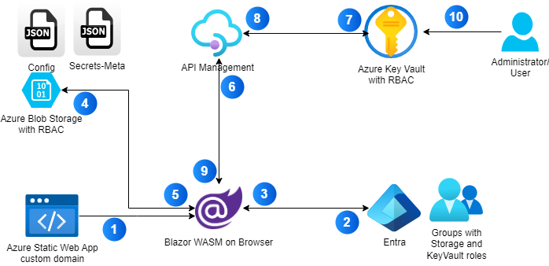

# Architecture

[main](../README.md)

This document will walk through the details of the solution.

## Details

1. When a user visits the Azure KeyVault site with a domain name, the request will be directed to Azure Static Web App. The Web App will return the Blazor WASM content back to the browser.
1. Blazor WASM will check if the user is authenticated, and if not, redirect the user to Entra to sign in.
1. A bearer token will be returned back to the Blazor WASM app. 
1. The Blazor WASM app will connect to the Azure Blob storage endpoint to pull a `Config.json` and `secrets-meta.json`. We should note that the user bearer token is used to authorize access to the Storage account. Another security feature is that CORS is turned on for the domain name listed.
1. The `Config.json` file contains the information related to making calls to the API management (APIM) which includes the APIM SubscriptionKey. The  `secrets-meta.json` contains the display names of the secret. When we create a secret in KeyVault, we cannot give it a friendly name as we need to following a naming convention. The `secrets-meta.json` will help store the secret friendly name.
1. Blazor WASM makes a call to APIM to get all secrets with the user bearer token.
1. APIM forwards the call Azure KeyVault. We should note that the user bearer token is used to authorize access to the Azure KeyVault.
1. The list of meta information related to secrets are returned back to APIM.
1. The list of meta information related to secrets are returned back to Blazor WASM. The list of secrets are displayed in the UI and use the `secrets-meta.json` to display a friendly name. If a user chose to reveal a secret, another call is made to Azure KeyVault via APIM to get the secret value and shown. The user can also change the friendly name of the secret and changes will be reflected back to the blob.
1. If there needs to be changes to the secrets, an Administrator can log into the Azure Portal to add or edit the secret.

## Takeaways

1. This solution is really designed for a single user to read secrets although it doesn't prevent multiple users from reading secrets either. The concurrency issue comes if there are more than 1 user updating the friendly name since there is only 1 blob configuration.
1. The solution really makes use of Entra for all its AuthN and AuthZ needs. We can also now enjoy a more complex way of assigning roles on groups and then assigning users the appropriate roles.
1. APIM is required because unlike Azure Storage, Azure KeyVault does not support CORS, so Blazor WASM cannot access it directly. Hence APIM is included to help with this gap.