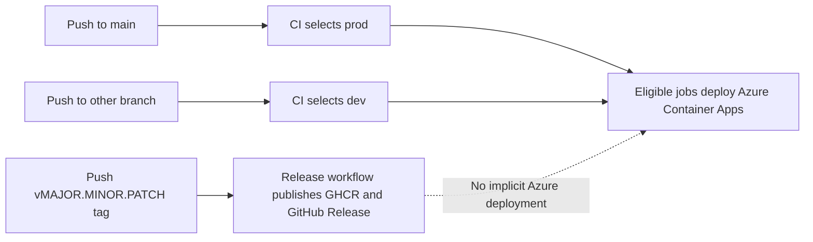

## Status

Proposed. This document records the repository's current implementation and the
operational safeguards required to rely on it.

## Decision Summary

The CI/CD workflow uses the exact branch name to select its GitHub Environment:

| Git reference | Selected environment | Current intent |
| -------------------------- | -------------------- | ---------------------------- |
| `main` | `prod` | Production deployment path |
| Any other pushed branch | `dev` | Shared development deployment path |
| Tag | Not handled by `cicd.yml` | Public release workflow owns tag processing |

The rule is intentionally broader than a naming convention such as `feat/*`,
`fix/*`, or `release/*`. A branch named `release/1.0.0`, for example, currently
selects `dev` because it is not `main`.

Environment selection is not evidence that an Azure deployment completed. A
selected environment supplies the configuration context for the downstream jobs;
those jobs must still be eligible and succeed.

## Scope

This design defines the relationship among branch pushes, GitHub Environments,
infrastructure provisioning, application-image publication, and Azure Container
Apps deployment.

It does not change the existing workflow, configure GitHub or Azure resources, or
approve a broader branching strategy.

## Environment Model

### Development

`dev` is the shared non-production environment. CI selects it for every branch
push other than `main`. The E2E job runs only when `dev` is selected and reads
environment-scoped variables and secrets from the `dev` GitHub Environment.

The current application image tag in Azure Container Registry is
`dev-<short-commit-sha>`. This identifies a development build and is not a
semantic release version.

Because every non-`main` branch selects the same environment, concurrent work can
replace the development deployment. Branch naming alone does not isolate a
development environment or create a promotion gate.

### Production

CI selects `prod` only for a push to `main`. The `prod` GitHub Environment
provides the environment-scoped deployment variables and may enforce configured
protection rules.

The workflow currently skips the E2E job when `prod` is selected, while the build
and deployment jobs declare that job as a dependency. Before documenting an
automatic completed production deployment, maintainers must verify a successful
`main` run or adjust the workflow's dependency conditions. The repository source
alone establishes `prod` selection, not a successful end-to-end deployment.

The current production ACR image tag is `latest`, with an additional short commit
SHA tag. The public-release design proposes moving stable GHCR `latest` ownership
to the tag-triggered release workflow; that proposal does not change ACR tagging
or Azure deployment in this design.

## CI Routing And Deployment

The [`cicd.yml`](../.github/workflows/cicd.yml) `setup` job compares
`GITHUB_REF` with `refs/heads/main` and writes `prod` or `dev` to its
`build_env` output. Subsequent jobs use that output for their GitHub Environment
and behavior:

| CI concern | `dev` behavior | `prod` behavior |
| ----------------------- | --------------------------------------------------- | ----------------------------------------------------------------- |
| E2E tests | Runs against `dev` environment configuration | Is conditionally skipped |
| ACR image tag | `dev-<short-commit-sha>` | `latest` plus short commit SHA |
| GHCR image publication | Not published by the current workflow | Current workflow publishes `latest` and short commit SHA |
| Container Apps deployment | Uses `dev` environment variables and resource group | Uses `prod` environment variables and resource group when downstream jobs are eligible |

The deployment job discovers the target resources from the selected environment's
`RESOURCE_GROUP` and deploys the image to Azure Container Apps. CI does not
derive an environment from the resource group, Bicep template, image tag, or
release version.

## Infrastructure Provisioning

Application deployment and infrastructure provisioning are separate operations.
The [`deploy-infra.yml`](../.github/workflows/deploy-infra.yml) workflow is
manually dispatched with an explicit `dev` or `prod` input. It passes that value
to [`main.bicep`](../Deployment/main.bicep), where it is used for resource names,
tags, and environment-specific configuration.

Bicep accepts the chosen environment but does not inspect a Git branch. Access to
the manually dispatched workflow and its selected GitHub Environment must be
protected independently from branch routing.

## GitHub Environments And Identity

Each GitHub Environment contains its own deployment variables, including
`RESOURCE_GROUP`, `AZURE_CLIENT_ID`, `AZURE_TENANT_ID`, and
`AZURE_SUBSCRIPTION_ID`. Application registration values are also configured per
environment.

[`setup-gh-deploy.ps1`](../Deployment/setup-gh-deploy.ps1) defines intended OIDC
federated-credential subjects for the `main` branch and for the `dev` and `prod`
GitHub Environments. Environment-scoped jobs normally rely on the corresponding
environment subject, but the script is not evidence that the identity exists or
that its settings remain current in Microsoft Entra ID.

Before relying on this model, maintainers must verify these repository-external
controls:

* The `dev` and `prod` GitHub Environments contain the expected variables and
  secrets.
* The Microsoft Entra application has active federated credentials for the
  `main`, `dev`, and `prod` subjects created by the setup script.
* `prod` protection rules require the intended reviewers or checks.
* Access to workflow dispatch, environment modification, and Azure role
  assignments is limited to deployment maintainers.

## Release Interaction

A GitHub Release identifies a public, versioned artifact. An Azure deployment
selects infrastructure and runtime configuration. They are separate controls.

The [release versioning design](release-versioning-design.md) specifies a
tag-triggered workflow for semantic GHCR images and GitHub Releases. That
workflow must not implicitly deploy to `prod`. Conversely, a `main` push selects
the `prod` environment under the current CI rule but does not create a semantic
GitHub Release.

## Operational Guidance

Use a branch push to validate or update the shared development deployment. Use a
merged `main` commit only after its production protections and workflow behavior
have been verified. Use a semantic GHCR version or digest to identify a public
release; do not infer that identity from the Azure Container Registry `latest`
tag.

If the shared `dev` environment becomes disruptive, change CI in a separately
reviewed decision to restrict deployment-triggering branch patterns or introduce
isolated preview environments. Do not treat this documentation as an authorization
for those changes.

## Verification Checklist

* Confirm a non-`main` branch selects the `dev` GitHub Environment.
* Confirm a `main` push selects the `prod` GitHub Environment.
* Confirm a successful `main` workflow run before treating production deployment
  as automatic.
* Confirm the configured OIDC subjects and GitHub Environment protections match
  the setup model.
* Confirm `deploy-infra.yml` is manually dispatched with the intended environment.
* Confirm a semantic tag creates public release artifacts without deploying Azure.

## References

* [CI/CD workflow](../.github/workflows/cicd.yml)
* [Infrastructure deployment workflow](../.github/workflows/deploy-infra.yml)
* [Bicep environment parameter](../Deployment/main.bicep)
* [GitHub deployment setup](../Deployment/setup-gh-deploy.ps1)
* [GitHub Release and Container Versioning Design](release-versioning-design.md)
