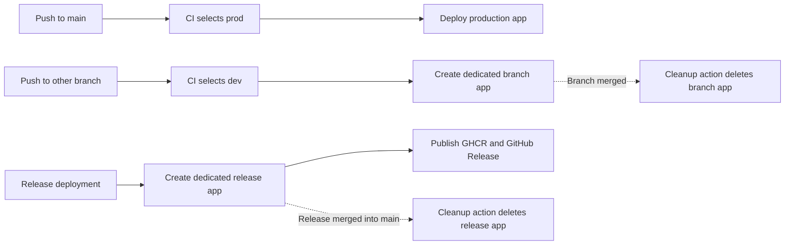

## Status

Current. This document records the per-branch and per-release
Container App lifecycle and the operational safeguards required to rely on it.

The checked-in workflows implement the per-reference deployment, hosted E2E,
and cleanup paths. Azure resources and GitHub Environment values remain
deployment prerequisites that must be verified outside the repository.

## Decision Summary

The CI/CD workflow uses the exact branch name to select its GitHub Environment
and each branch or release deployment receives its own temporary Container App:

| Git reference | Selected environment | Container App lifecycle |
| -------------------------- | -------------------- | ---------------------- |
| `main` | `prod` | Production deployment path |
| Any other pushed branch | `dev` | Creates a dedicated branch Container App |
| `release/*` branch | `dev` | Creates a dedicated release Container App |
| Tag | Not handled by `cicd.yml` | Public release workflow owns tag processing |

The rule is intentionally broader than a naming convention such as `feat/*` or
`fix/*`. A `release/*` branch still selects `dev`, but receives the release app
name and release image tag used by the hosted validation lifecycle.

Environment selection is not evidence that an Azure deployment completed. A
selected environment supplies the configuration context for the downstream jobs;
those jobs must still be eligible and succeed. The Container App name must be
derived from the branch or release identity so that separate deployments do not
update one shared app.

## Scope

This design defines the relationship among branch pushes, release deployments,
GitHub Environments, infrastructure provisioning, application-image publication,
temporary Azure Container Apps, hosted Playwright execution, and merge cleanup.

It does not configure GitHub or Azure resources or approve a broader branching
strategy.

## Environment Model

### Development

`dev` is the shared non-production environment. CI selects it for every branch
push other than `main`. Each branch deployment creates a separate Container App
in the shared `dev` resource group. Hosted Playwright runs in its own workflow,
manually for a selected branch and automatically after successful `CI/CD` runs
for `release/**` branches.

Branch Container Apps reuse the existing user-assigned managed identity in the
`dev` environment. The deployment action discovers that identity and assigns it
to each new app; it does not create a managed identity for every branch.

Branch images use `branch-<normalized-branch>` and release images use
`release-<normalized-version>`. The commit SHA remains available from the
workflow and deployment metadata for immutable traceability.

Because every non-`main` branch selects the same environment and resource group,
the app name and cleanup logic must be derived from a validated branch identity.
The shared environment does not by itself create a promotion gate.

### Production

CI selects `prod` only for a push to `main`. The `prod` GitHub Environment
provides the environment-scoped deployment variables and may enforce configured
protection rules.

The deployment workflow does not run hosted Playwright for `main`. Production
deployment and hosted validation are separate concerns under this design.

The current production GHCR image tag is `latest`, with an additional short
commit SHA tag. A release deployment creates a dedicated release Container App
rather than updating a branch app. The public-release design proposes moving
stable GHCR `latest` ownership to the tag-triggered release workflow; that
proposal does not change the temporary release-app cleanup contract.

## CI Routing And Deployment

The [`cicd.yml`](../.github/workflows/cicd.yml) `setup` job compares
`GITHUB_REF` with `refs/heads/main` and writes `prod` or `dev` to its
`build_env` output. Subsequent jobs use that output for their GitHub Environment
and behavior:

| CI concern | `dev` behavior | `prod` behavior |
| ----------------------- | --------------------------------------------------- | ----------------------------------------------------------------- |
| Hosted E2E tests | Separate workflow, manual for branches and automatic after successful `CI/CD` runs for `release/**` | Not run by this workflow |
| GHCR image tag | `branch-<normalized-branch>` or `release-<normalized-version>` | `latest` plus short commit SHA |
| GHCR image publication | Current workflow publishes the branch or release tag | Current workflow publishes `latest` and short commit SHA |
| Container Apps deployment | Creates a dedicated app per branch and reuses the existing `dev` managed identity | Creates a dedicated release or production app using the selected production configuration |
| Merge cleanup | Deletes the branch app and matching `branch-<normalized-branch>` GHCR image after its branch is merged | Deletes the release app and matching `release-<normalized-version>` GHCR image after the release is merged into `main` |

The deployment job discovers the target resources from the selected environment's
`RESOURCE_GROUP` and deploys the image to Azure Container Apps. CI derives the
app name from the source branch or release identity, while the cleanup action
uses the same identity to find and delete the app after merge. CI does not derive
an environment from the resource group, Bicep template, image tag, or release
version.

The cleanup action must verify the source identity and resource group before
deleting anything. It must be idempotent when the app or matching GHCR image is
already absent and must not delete the long-lived infrastructure, the production
app used by the `main` deployment, or production image tags.

## Infrastructure Provisioning

Application deployment and infrastructure provisioning are separate operations.
The [`deploy-infra.yml`](../.github/workflows/deploy-infra.yml) workflow is
manually dispatched with an explicit `dev` or `prod` input. It passes that value
to [`main.bicep`](../Deployment/main.bicep), where it is used for resource names,
tags, and environment-specific configuration.

Bicep accepts the chosen environment but does not inspect a Git branch. Access to
the manually dispatched workflow and its selected GitHub Environment must be
protected independently from branch routing.

The per-branch and per-release Container Apps are application-level resources.
They reuse the environment's existing managed identity and are removed by the
merge-cleanup action; they are not provisioned as permanent Bicep infrastructure.

## GitHub Environments And Identity

Each GitHub Environment contains its own deployment variables, including
`RESOURCE_GROUP`, `AZURE_CLIENT_ID`, `AZURE_TENANT_ID`, and
`AZURE_SUBSCRIPTION_ID`. Application registration values are also configured per
environment.

The `dev` deployment reuses the existing user-assigned managed identity for every
branch Container App. The identity is shared by those apps, while the apps
themselves remain separate resources. The cleanup action must remove only the
Container App associated with the merged branch or release and must leave the
managed identity in place for future deployments.

[`setup-gh-deploy.ps1`](../Deployment/setup-gh-deploy.ps1) defines intended OIDC
federated-credential subjects for the `main` branch and for the `dev` and `prod`
GitHub Environments. Environment-scoped jobs normally rely on the corresponding
environment subject, but the script is not evidence that the identity exists or
that its settings remain current in Microsoft Entra ID.

Before relying on this model, maintainers must verify these repository-external
controls:

* The `dev` and `prod` GitHub Environments contain the expected variables and
  secrets.
* The Microsoft Entra application has active federated credentials for the
  `main`, `dev`, and `prod` subjects created by the setup script.
* `prod` protection rules require the intended reviewers or checks.
* Access to workflow dispatch, environment modification, and Azure role
  assignments is limited to deployment maintainers.

## Release Interaction

A GitHub Release identifies a public, versioned artifact. An Azure deployment
selects infrastructure and runtime configuration. They are separate controls,
and a release deployment may create a temporary release Container App for
validation without making that app a permanent production resource.

The [release versioning design](release-versioning-design.md) specifies a
tag-triggered workflow for semantic GHCR images and GitHub Releases. If the
release workflow creates a validation Container App, it must reuse the existing
managed identity for the selected environment and remove the app when the
release is merged into `main`. The workflow must not implicitly convert that
temporary app into the long-lived production deployment. Conversely, a `main`
push selects the `prod` environment under the current CI rule but does not
create a semantic GitHub Release.

## Operational Guidance

Use a branch push to validate a dedicated development Container App. The app
reuses the existing `dev` managed identity and remains available until the
branch is merged, after which the cleanup action removes it. Use a merged
`main` commit only after its production protections and workflow behavior have
been verified. A release validation app follows the same lifecycle and is
removed after the release is merged into `main`.

Use a semantic GHCR version or digest to identify a public release; do not infer
that identity from the mutable GHCR `latest` tag.

If the shared `dev` environment becomes disruptive, change CI in a separately
reviewed decision to restrict deployment-triggering branch patterns or introduce
isolated preview environments. Do not treat this documentation as an authorization
for those changes.

## Verification Checklist

* Confirm a non-`main` branch selects the `dev` GitHub Environment.
* Confirm each branch deployment creates a distinct Container App.
* Confirm branch Container Apps reuse the existing `dev` managed identity.
* Confirm the cleanup action deletes a branch Container App after merge and leaves
  the managed identity and shared infrastructure intact.
* Confirm a `main` push selects the `prod` GitHub Environment.
* Confirm a successful `main` workflow run before treating production deployment
  as automatic.
* Confirm a release deployment creates a distinct Container App and the cleanup
  action deletes it after the release is merged into `main`.
* Confirm the configured OIDC subjects and GitHub Environment protections match
  the setup model.
* Confirm `deploy-infra.yml` is manually dispatched with the intended environment.
* Confirm a semantic tag creates public release artifacts without deploying Azure.

## References

* [CI/CD workflow](../.github/workflows/cicd.yml)
* [Hosted Playwright workflow](../.github/workflows/hosted-e2e.yml)
* [Container App cleanup workflow](../.github/workflows/cleanup-container-app.yml)
* [Infrastructure deployment workflow](../.github/workflows/deploy-infra.yml)
* [Bicep environment parameter](../Deployment/main.bicep)
* [GitHub deployment setup](../Deployment/setup-gh-deploy.ps1)
* [GitHub Release and Container Versioning Design](release-versioning-design.md)
