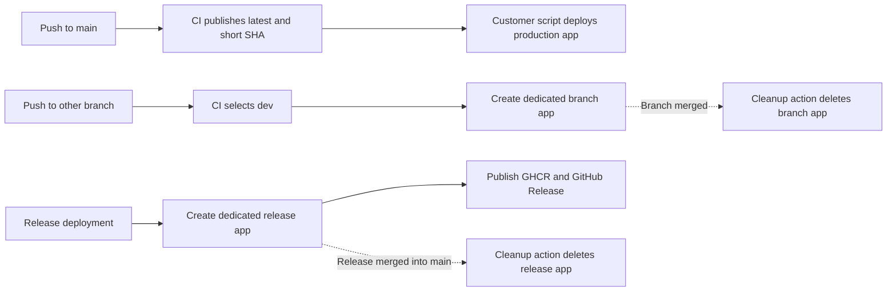

## Status

Current. This document records the per-branch and per-release
Container App lifecycle and the operational safeguards required to rely on it.

The checked-in workflows implement the per-reference deployment, hosted E2E,
and cleanup paths. Azure resources and GitHub Environment values remain
deployment prerequisites that must be verified outside the repository. Hosted
E2E uses the protected `dev` deployment identity with an `E2E.Tester` role on
the dedicated dev API registration.

## Decision Summary

The CI/CD workflow uses the `dev` GitHub Environment only for non-`main`
deployment jobs. Each branch or release deployment receives its own temporary
Container App:

| Git reference | Selected environment | Container App lifecycle |
| -------------------------- | -------------------- | ---------------------- |
| `main` | None | Publishes `latest` and a short-SHA image tag; customer deployment owns production updates |
| Any other pushed branch | `dev` | Creates a dedicated branch Container App |
| `release/*` branch | `dev` | Creates a dedicated release Container App |
| Tag | Not handled by `cicd.yml` | Public release workflow owns tag processing |

The non-`main` rule is intentionally broader than a naming convention such as
`feat/*` or `fix/*`. A `release/*` branch selects `dev`, but receives the
release app name and release image tag used by the hosted validation lifecycle.

Environment selection is not evidence that an Azure deployment completed. A
selected environment supplies the configuration context for the downstream jobs;
those jobs must still be eligible and succeed. The Container App name must be
derived from the branch or release identity so that separate deployments do not
update one shared app.

## Scope

This design defines the relationship among branch pushes, release deployments,
GitHub Environments, infrastructure provisioning, application-image publication,
temporary Azure Container Apps, hosted Playwright execution, and merge cleanup.

It does not configure GitHub or Azure resources or approve a broader branching
strategy.

## Environment Model

### Development

`dev` is the shared non-production environment. CI selects it for every branch
push other than `main`. Each branch deployment creates a separate Container App
in the shared `dev` resource group. Hosted Playwright runs in its own workflow
only after a successful `CI/CD` run for a `release/**` branch or after a
same-repository `release/**` pull request is merged into `main`. In the
merged-PR case, it tests the deployed release Container App. Ordinary branch CI
completions and direct development-branch merges into `main` do not trigger
hosted E2E.

Branch Container Apps reuse the existing user-assigned managed identity in the
`dev` environment. The deployment action discovers that identity and assigns it
to each new app; it does not create a managed identity for every branch.

Branch images use `branch-<normalized-branch>-<12-char-ref-hash>` and release
images use `release-<normalized-version>-<12-char-ref-hash>`. The commit SHA
remains available from the workflow and deployment metadata for immutable
traceability.

Because every non-`main` branch selects the same environment and resource group,
the app name and cleanup logic must be derived from a validated branch identity.
The shared environment does not by itself create a promotion gate.

### Customer-Managed Production

A push to `main` builds and publishes the mutable `latest` GHCR image plus a
short commit-SHA tag. It does not select a GitHub Environment, authenticate to
Azure, or deploy a Container App. The customer deployment script is responsible
for selecting the production credentials, infrastructure, and image reference.

The deployment workflow does not run hosted Playwright for `main`. Customer
production deployment and hosted validation are separate concerns under this
design.

Customer deployments should use the short SHA tag or an image digest instead of
the mutable `latest` tag. A release deployment creates a dedicated release
Container App rather than updating a branch app. The public-release design
proposes moving stable GHCR `latest` ownership to the tag-triggered release
workflow; that proposal does not change the temporary release-app cleanup
contract.

### Customer Deployments

Customers provision their own development and production environments. Each
customer API registration exposes delegated user access only. It does not
define `E2E.Tester`, permit application-only access to the API, or assign a
GitHub service principal. Customer deployments must use registrations distinct
from the repository maintainer's dev API registration.

The repository's hosted E2E workflow targets only the maintainer-owned `dev`
environment. Its separate E2E service principal can perform all API operations
against the dev API, but it has no application-role assignment, Azure RBAC, or
valid token audience for customer or production environments. Microsoft Entra
application roles are registration-wide, so this boundary requires separate
dev and non-dev API registrations rather than a single shared registration.
`Setup-Dev.ps1` reads the single maintainer target from `setup-dev.json` and
rejects its app-registration name when it appears in a same-tenant customer
target in `setup.json`.

## CI Routing And Deployment

The [`cicd.yml`](../.github/workflows/cicd.yml) `setup` job derives a Container
App name. The image build and publication job has no GitHub Environment. The
Azure deployment job runs only for non-`main` branches and uses `dev`:

| CI concern | Non-`main` behavior | `main` behavior |
| ----------------------- | --------------------------------------------------- | ----------------------------------------------------------------- |
| Hosted E2E tests | Separate workflow, automatic after successful `CI/CD` runs for `release/**` or same-repository `release/**` PR merges into `main` | Not run by this workflow |
| GHCR image tag | `branch-<normalized-branch>-<12-char-ref-hash>` or `release-<normalized-version>-<12-char-ref-hash>` | `latest` plus short commit SHA |
| GHCR image publication | Current workflow publishes the branch or release tag | Current workflow publishes `latest` and short commit SHA |
| Container Apps deployment | Creates a dedicated app per branch and reuses the existing `dev` managed identity | Not performed by CI |
| Merge cleanup | Deletes the branch app and matching `branch-<normalized-branch>-<12-char-ref-hash>` GHCR image after its branch is merged | Deletes the release app and matching `release-<normalized-version>-<12-char-ref-hash>` GHCR image after the release is merged into `main` |

The deployment job discovers the target resources from the `dev` environment's
`RESOURCE_GROUP` and deploys the image to Azure Container Apps. CI derives the
app name from the source branch or release identity, while the cleanup action
uses the same identity to find and delete the app after merge. CI does not
derive an environment from the resource group, Bicep template, image tag, or
release version.

The cleanup action must verify the source identity and resource group before
deleting anything. It must be idempotent when the app or matching GHCR image is
already absent and must not delete the long-lived infrastructure, the production
app used by the `main` deployment, or production image tags.

## Infrastructure Provisioning

Application deployment and infrastructure provisioning are separate operations.
The [`deploy-infra.yml`](../.github/workflows/deploy-infra.yml) workflow is
manually dispatched for `dev`. It passes that value to
[`main.bicep`](../Deployment/main.bicep), where it is used for resource names,
tags, and environment-specific configuration.

Bicep continues to support production configuration for the customer deployment
process, but it does not inspect a Git branch. Access to the manually dispatched
workflow and the customer deployment process must be protected independently
from branch routing.

The per-branch and per-release Container Apps are application-level resources.
They reuse the environment's existing managed identity and are removed by the
merge-cleanup action; they are not provisioned as permanent Bicep infrastructure.

## GitHub Environments And Identity

The `dev` GitHub Environment contains the deployment variables
`RESOURCE_GROUP`, `AZURE_CLIENT_ID`, `AZURE_TENANT_ID`, and
`AZURE_SUBSCRIPTION_ID`. Application registration values are configured for the
same environment.

The hosted E2E workflow uses the existing `dev` deployment identity. That
principal retains its deployment permissions and is assigned the dedicated dev
API's `E2E.Tester` role. Customer environments do not define or assign that
role.

The `dev` deployment reuses the existing user-assigned managed identity for every
branch Container App. The identity is shared by those apps, while the apps
themselves remain separate resources. The cleanup action must remove only the
Container App associated with the merged branch or release and must leave the
managed identity in place for future deployments.

[`setup-gh-deploy.ps1`](../Scripts/setup-gh-deploy.ps1) defines an intended
OIDC federated-credential subject for the `dev` GitHub Environment. The script
is not evidence that the identity exists or that its settings remain current in
Microsoft Entra ID.

Before relying on this model, maintainers must verify these repository-external
controls:

* The `dev` GitHub Environment contains the expected variables and secrets.
* The `dev` GitHub Environment is limited to this repository and protected
  release branches, requires the intended reviewers, and protects both its
  deployment variables and the hosted E2E workflow.
* The Microsoft Entra application has an active federated credential for the
  `dev` environment subject created by the setup script.
* Access to workflow dispatch, environment modification, and Azure role
  assignments is limited to deployment maintainers.
* The maintainer dev API registration and customer or production API
  registrations are distinct, and only the dev API registration exposes
  `E2E.Tester` to the `dev` deployment principal.

## Release Interaction

A GitHub Release identifies a public, versioned artifact. An Azure deployment
selects infrastructure and runtime configuration. They are separate controls,
and a release deployment may create a temporary release Container App for
validation without making that app a permanent production resource.

The [release versioning design](release-versioning-design.md) specifies a
tag-triggered workflow for semantic GHCR images and GitHub Releases. If the
release workflow creates a validation Container App, it must reuse the existing
managed identity for the selected environment and remove the app when the
release is merged into `main`. The workflow must not implicitly convert that
temporary app into the long-lived production deployment. Conversely, a `main`
push publishes a main image but does not create a semantic GitHub Release or
deploy Azure resources.

## Operational Guidance

Any non-`main` branch push creates a dedicated development Container App, but
does not trigger hosted E2E unless the branch is `release/**`. The app reuses
the existing `dev` managed identity and remains available until the branch is
merged into a release branch, after which the cleanup action removes its branch
GHCR image. Main and `release/*` pushes update the corresponding permanent
Container App by immutable digest, then run hosted E2E under a target-scoped
FIFO queue. A feature or bugfix branch image is deployed only when a maintainer
runs `Invoke-HostedE2E.ps1 -Current` locally against the permanent branch app.

Use a semantic GHCR version or digest to identify a public release; do not infer
that identity from the mutable GHCR `latest` tag.

If the shared `dev` environment becomes disruptive, change CI in a separately
reviewed decision to restrict deployment-triggering branch patterns or introduce
isolated preview environments. Do not treat this documentation as an authorization
for those changes.

## Verification Checklist

* Confirm `Setup-Dev.ps1` configures the main, release, and branch custom domains
  and reconciles all three redirect URLs.
* Confirm `main` and `release/*` runs select the `dev` GitHub Environment, deploy
  only their matching permanent target, and complete E2E before their target queue advances.
* Confirm a feature or bugfix CI run publishes an immutable commit image without
  selecting a GitHub Environment or deploying Azure resources.
* Confirm the local branch command verifies its approved origin and commit digest
  before updating only the permanent branch app.
* Confirm the customer deployment process selects an immutable main image tag or
  digest before updating production.
* Confirm a release merge publishes semantic release artifacts only after the
  successful main deployment and E2E run for that exact merge SHA.
* Confirm the configured dev OIDC subject and GitHub Environment protections
  match the setup model.
* Confirm the dev E2E OIDC principal is distinct from deployment identities and
  has no Azure or API access outside the maintainer dev environment.
* Confirm customer and production API registrations expose only delegated user
  access and do not define `E2E.Tester`.
* Confirm `deploy-infra.yml` is manually dispatched only for `dev`.
* Confirm a semantic tag creates public release artifacts without deploying Azure.

## References

* [CI/CD workflow](../.github/workflows/cicd.yml)
* [Release promotion workflow](../.github/workflows/release-promotion.yml)
* [GHCR image cleanup workflow](../.github/workflows/cleanup-container-app.yml)
* [Infrastructure deployment workflow](../.github/workflows/deploy-infra.yml)
* [Bicep environment parameter](../Deployment/main.bicep)
* [GitHub deployment setup](../Scripts/setup-gh-deploy.ps1)
* [GitHub Release and Container Versioning Design](release-versioning-design.md)
