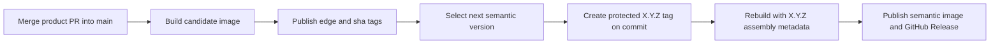

## Status

Proposed

## Decision summary

Eklee KeyVault will use a Git tag in the exact form `MAJOR.MINOR.PATCH` as the
canonical release version. Pushing a valid tag from a commit on `main` will run a
dedicated GitHub Actions release workflow. The workflow will validate and build
the tagged source, publish semantic version tags to GitHub Container Registry
(GHCR), generate supply-chain evidence, and create a GitHub Release with generated
release notes and container metadata assets.

The initial model will not use a permanent release branch. A branch identifies a
moving line of development, while the protected semantic tag identifies the exact,
immutable source for a release. Version-specific maintenance branches can be added
later if the project needs concurrent release stabilization or must service more
than one supported release line.

The release workflow will own the `latest` GHCR tag. The existing main-branch
workflow will stop publishing `latest` to GHCR and will publish development images
as `edge` and commit-derived tags instead. Azure deployment consumes the same
public GHCR images by tag or digest and remains independent from public GitHub
Releases.

The first recommended release is `1.0.0`. The application is already distributed
publicly, and the private UI manifest currently declares version `1.0.0`. If the
maintainer does not consider the public configuration and API contracts stable,
`0.1.0` can be selected before implementing the workflow without changing the
rest of this design.

## Context

Eklee KeyVault is delivered as one Docker image containing the React frontend and
ASP.NET API. The repository is not currently publishing an npm or NuGet package:

* The UI package is marked `private`, so its version is not a distribution version.
* The API project is a web application and has no NuGet package configuration.
* The [Dockerfile](../Dockerfile) produces the deployable runtime artifact.
* The [current CI/CD workflow](../.github/workflows/cicd.yml) publishes the image to
  GHCR from `main` with `latest` and an eight-character commit tag.
* The [public GHCR package](https://github.com/seekdavidlee/eklee-keyvault/pkgs/container/eklee-keyvault)
  has no semantic version tags.
* The [GitHub Releases page](https://github.com/seekdavidlee/eklee-keyvault/releases)
  has no releases or version tags.
* The [deployment guide](../README.md) instructs consumers to use `latest`, which is
  mutable and cannot identify a specific release.

The target experience follows the useful parts of the
[experiment-catalog release model](https://github.com/microsoft/experiment-catalog/releases):
validated semantic tags, automated release notes, versioned container images,
release metadata files, and a visible link between source, image, and digest.

## Goals

* Provide a clear, human-readable release history on GitHub.
* Give consumers immutable version and digest references for deployments.
* Apply Semantic Versioning consistently to the complete application image.
* Build each released image from the tagged source through an auditable workflow.
* Preserve convenient moving aliases such as `latest`, `1`, and `1.2` without
  treating them as immutable identifiers.
* Generate release notes from merged pull requests and labels.
* Use least-privilege workflow permissions and short-lived GitHub credentials.
* Produce enough metadata to trace a release to its source commit and image digest.
* Keep public release publication separate from environment deployment.

## Non-goals

* Publishing the React application to npm.
* Publishing the ASP.NET application as a NuGet package.
* Automatically deploying a GitHub Release to production.
* Versioning Azure infrastructure independently from the application in the first
  implementation.
* Supporting pre-release identifiers such as `-alpha.1` or `-rc.1` in the first
  implementation.
* Maintaining multiple supported major or minor release lines in the first
  implementation.
* Guaranteeing bit-for-bit reproducible builds in the first implementation.
* Changing Azure infrastructure independently from the application image workflow.

## Versioning policy

### Canonical version

The canonical source of a release version is an annotated Git tag:
`MAJOR.MINOR.PATCH`. Examples include `1.0.0`, `1.2.0`, and `1.2.3`.

The Git tag, GitHub Release title, and container tag use the same bare semantic
version. The UI manifest and API project do not determine the release version. The
workflow
derives the version from the tag and injects it into the container labels and .NET
publish operation.

Only stable versions are initially accepted. The release workflow must reject tags
that do not match this regular expression:

```text
^(0|[1-9][0-9]*)\.(0|[1-9][0-9]*)\.(0|[1-9][0-9]*)$
```

The workflow must also verify that the tagged commit is reachable from `main`. This
prevents releases from unreviewed branches even if a user can create a tag.

### Release milestone

Each release must have one open GitHub milestone whose title exactly matches the
bare semantic version, such as `1.4.2`. The milestone is a release-planning and
issue-tracking record; it does not define the canonical version, trigger the
release workflow, or replace the immutable Git tag.

The release-preparation command verifies that the authenticated `gh` account has
repository write access, rejects duplicate or closed matching milestones, and
creates a missing milestone before it creates or pushes the tag. A milestone that
remains after a failed local tag creation or push requires manual resolution; the
command must not delete it automatically.

### Semantic Versioning rules

The application image, API behavior, configuration contract, and persistent data
contract form one versioned product. The highest-impact change since the previous
release determines the increment.

1. A major increment applies when a consumer must change configuration,
  automation, integration code, or persisted data to upgrade. Examples include
  removing an API route, renaming a required environment variable, or changing
  stored ACL data.
2. A minor increment applies when backward-compatible capabilities are added.
  Examples include adding an optional setting, API route, role, or UI feature.
3. A patch increment applies to backward-compatible defect, dependency,
  documentation, and security corrections. Examples include fixing a UI error,
  updating a dependency, or closing a vulnerability.

A security fix does not automatically require a major version. Its compatibility
impact determines the version increment.

### Pull request labels

Pull requests should carry exactly one release-impact label. Automation can enforce
this after the initial release workflow is established.

| Label           | Meaning                                                   |
|-----------------|-----------------------------------------------------------|
| `semver:major`  | Requires the next major version                           |
| `semver:minor`  | Requires the next minor version                           |
| `semver:patch`  | Requires the next patch version                           |
| `release:skip`  | Does not affect the shipped product or release notes      |

If several labels occur between releases, the highest increment wins. Labels guide
the maintainer but do not automatically create a version in the first phase.

### Main merge and release lifecycle

Merging a normal pull request into `main` does not assign a new semantic version.
The main-branch workflow builds a candidate image and publishes these moving or
source-oriented references:

* `ghcr.io/seekdavidlee/eklee-keyvault:edge`
* `ghcr.io/seekdavidlee/eklee-keyvault:sha-<commit>`

The candidate has no `MAJOR.MINOR.PATCH` image tag because the maintainer has not yet
selected a release version. It is buildable and traceable, but it is not a release.
The pull request labels accumulated since the previous release indicate whether the
next release should be major, minor, or patch.

When the maintainer selects the commit and creates `MAJOR.MINOR.PATCH`, the release
workflow checks out that exact commit and performs a release build. It injects the
selected version into the .NET assembly and OCI metadata, publishes the semantic
image tags, and creates the GitHub Release.

The candidate and release images are separate builds of the same source commit and
will usually have different digests. Injecting the semantic version changes the API
assembly and image labels. The main-branch candidate cannot be promoted by adding a
semantic image tag without creating a mismatch between the image tag and assembly
version.



This model favors a simple source history and correct embedded metadata over
build-once artifact promotion. Provenance, the source revision, and release tests
provide the audit link between the candidate and release builds.

### Build-once alternative with a release pull request

If promoting the exact main-branch image digest is a requirement, the semantic
version must be known before that image is built. A release pull request provides
that boundary.

GitHub does not define a release pull request as a distinct pull-request type. In
this design, a release pull request is an ordinary pull request that repository
automation and policy classify as the release declaration. It is also distinct from
a GitHub Release, which is the published release object created after the pull
request merges and the semantic tag exists.

The policy recognizes a release pull request by combining a trusted automation
author, a configured release branch naming pattern, the expected target branch, and
an allowlist of release-only file changes. A label can make the classification
visible to reviewers, but it must not be the only security boundary because GitHub
does not provide a protected-label primitive.

The lifecycle is:

1. Normal product pull requests merge into `main` and update the pending release
  notes and version recommendation.
2. Automation opens or refreshes a release pull request containing the selected
  version, changelog, and a small version file such as `VERSION`.
3. Merging the release pull request into `main` declares the release version before
  the image build starts.
4. The workflow reads the version file, builds the image once with matching assembly
  metadata, creates the semantic Git tag, and publishes that same digest.

Release-please can implement this lifecycle from Conventional Commits. A custom
label-driven workflow can implement it from the `semver:*` labels if commit-message
enforcement is not desired. In either case, the version file records the intended
version in source, while the protected tag remains the immutable identity of the
published release. The workflow must validate that they match.

The release pull request model adds an extra approval and automation path, but it
supports true build-once promotion. It should replace, rather than run alongside,
the tag-triggered rebuild model if adopted.

### Version file enforcement

The `VERSION` file is committed at the repository root and contains one stable
Semantic Versioning value, for example `1.4.2`. It is not
manually updated in every product pull request. Only a release pull request advances
it.

A required status check named `release/version-policy` runs for every pull request to
`main` and for merge queue validation. It must not use path filters because a skipped
required workflow can leave a pull request permanently pending. The check compares
the pull request with its base branch and applies these rules.

For a normal product pull request:

* `VERSION` must be unchanged.
* Exactly one release-impact label must describe the change.
* A pull request that changes `VERSION` without being the recognized release pull
  request fails.

For a release pull request:

* `VERSION` must change exactly once and contain one valid stable semantic version.
* The new version must be greater than the version on the base branch.
* The increment must equal the highest release impact accumulated since the previous
  release. The validator calculates this independently from the release automation.
* The corresponding `<version>` tag must not already exist.
* The changelog and release metadata must be updated.
* Product source changes are not allowed. They must arrive through separately
  reviewed product pull requests.
* The pull request must satisfy every release recognition rule: trusted automation
  author, configured source branch pattern, `main` as the target, and only approved
  release-file changes. A release label alone is insufficient.

The check should always create a final job with a stable name and `if: always()` so
dependency failures cannot accidentally omit the required result. If a merge queue is
enabled, the workflow must handle both `pull_request` and `merge_group` events.

The `main` branch ruleset will require:

* Pull requests rather than direct pushes
* The `release/version-policy` status check
* The normal build and test checks
* Approval from a code owner when `VERSION`, release configuration, or release
  workflows change
* Dismissal of stale approvals after new commits
* Successful checks against the latest merge commit, using strict up-to-date checks
  or the merge queue
* No force pushes or branch deletion
* No routine administrator bypass

The `.github/CODEOWNERS` file will assign ownership of `VERSION`, `CODEOWNERS`, the
release configuration, and release workflows to the release maintainers. CODEOWNERS
approval supplements validation but does not replace it.

Together these controls make an invalid release version unmergeable. A checked-in
file by itself provides no enforcement; the required status check is the control that
turns the version policy into a merge requirement.

## Artifact and tag contract

A release of `1.4.2` from commit `abcdef123456...` will produce one image manifest
and the following references.

| Reference                                               | Mutability | Intended use                                      |
|---------------------------------------------------------|------------|---------------------------------------------------|
| `ghcr.io/seekdavidlee/eklee-keyvault:1.4.2`             | Immutable  | Normal production pin to an exact release         |
| `ghcr.io/seekdavidlee/eklee-keyvault:1.4`               | Moving     | Latest compatible patch in the `1.4` line         |
| `ghcr.io/seekdavidlee/eklee-keyvault:1`                 | Moving     | Latest compatible release in the `1` line         |
| `ghcr.io/seekdavidlee/eklee-keyvault:latest`            | Moving     | Latest stable release                             |
| `ghcr.io/seekdavidlee/eklee-keyvault:sha-abcdef123456`  | Immutable  | Source-oriented diagnosis                         |
| `ghcr.io/seekdavidlee/eklee-keyvault@sha256:<digest>`   | Immutable  | Maximum deployment and rollback reproducibility   |

All tags for one release must resolve to the same image digest. Consumers that need
strict repeatability should deploy the digest. Consumers that want controlled
updates can use the full semantic version. Major, minor, and `latest` aliases are
convenience references and must be documented as mutable.

Existing short-SHA tags remain available for historical compatibility. New release
work uses the explicit `sha-` prefix to distinguish a commit reference from a
semantic version.

### Image metadata

The release build will add standard Open Container Initiative labels:

* `org.opencontainers.image.created`
* `org.opencontainers.image.description`
* `org.opencontainers.image.licenses`
* `org.opencontainers.image.revision`
* `org.opencontainers.image.source`
* `org.opencontainers.image.title`
* `org.opencontainers.image.url`
* `org.opencontainers.image.version`

The source label associates the GHCR package with this repository. The revision and
version labels allow a running image to be traced without relying only on its tag.

### .NET assembly metadata

The release version must also be embedded in the published API assembly. For a Git
tag of `1.4.2`, the expected metadata is:

* Container version tag: `1.4.2`
* OCI image version label: `1.4.2`
* MSBuild `Version` property: `1.4.2`
* .NET assembly version: `1.4.2.0`
* .NET file version: `1.4.2.0`
* .NET informational version: `1.4.2+<full-commit-sha>`

The fourth component in assembly and file versions is required by the .NET version
format. These values represent the same semantic release even though their string
forms are not identical. The informational version adds the commit so support and
diagnostic tooling can identify the exact source.

The release workflow will pass `Version=1.4.2` and the full source revision to
`dotnet publish` through Docker build arguments. The .NET SDK will derive the
assembly, file, and informational versions from those values. The workflow must
inspect the assembly produced inside the final image and fail before publication if
the values do not correspond to the Git tag and source commit.

The first release will preserve the current `linux/amd64` platform. Multi-platform
publication for `linux/arm64` can be added after the application and end-to-end
checks run on that architecture.

## Proposed release architecture

```mermaid
flowchart LR
  A[Merge reviewed commit into main] --> B[Build edge and sha candidate]
  B --> C[Maintainer pushes X.Y.Z tag]
  C --> D[Validate tag and source commit]
  D --> E[Build and test versioned source]
  E --> F[Publish immutable GHCR tags]
  F --> G[Record digest and attest provenance]
  G --> H[Create release metadata assets]
  H --> I[Create GitHub Release and generated notes]
  I --> J[Promote major minor and latest aliases]
  J --> K[Consumers deploy version tag or digest]
```



### Workflow boundaries

Three concerns remain separate:

1. Pull request and branch CI validates changes before merge.
2. A new release workflow publishes the public, versioned GHCR package and GitHub
   Release from a tag.
3. The existing Azure workflow deploys Azure Container Apps from the public GHCR
  image according to its current environment rules.

The [environment and deployment design](environment-deployment-design.md) defines
the current CI branch routing and Azure environment boundary. Creating a GitHub
Release does not itself deploy an Azure environment.

The separation prevents a production environment failure from hiding a valid public
artifact and prevents a public release from implicitly changing an Azure environment.

## Branching strategy comparison

A release branch and a release tag solve different problems. A branch provides a
moving integration or maintenance line. A tag provides the immutable version anchor
required by GitHub Releases, container metadata, assembly metadata, provenance, and
rollback. Every branch-based model still needs a protected `MAJOR.MINOR.PATCH` tag
on the exact commit that is published.

### Tag a commit on `main`

The proposed model tags a reviewed commit that is reachable from `main`.

* Release source: protected `MAJOR.MINOR.PATCH` tag on `main`
* Version selection: maintainer chooses the tag using pull request impact labels
* Stabilization: changes must pass CI before merge; the release environment adds a
  final publication approval
* Hotfix: fix on `main`, then publish the next patch tag
* Advantages: one source of truth, no branch drift, no cherry-picks, simple generated
  notes, and the smallest workflow and ruleset surface
* Disadvantages: unsuitable when a release requires extended stabilization while
  incompatible development continues on `main`

This model fits the repository today because it publishes one application image, has
no existing releases, has one active development line, and has no documented policy
for servicing older versions.

### Use one permanent `release` branch

This model promotes selected changes from `main` into a long-lived branch and releases
from its head.

* Release source: protected semantic tag on the permanent `release` branch
* Version selection: still requires a tag, release input, or version file because the
  branch name does not identify `MAJOR.MINOR.PATCH`
* Stabilization: the branch can receive release-only validation while `main` advances
* Hotfix: the team must define whether fixes enter `main` first and are cherry-picked
  to `release`, or enter `release` first and are merged back
* Advantages: a stable promotion target and a clear boundary between development and
  releasable code
* Disadvantages: permanent divergence, merge or cherry-pick overhead, duplicated
  protection rules, ambiguous branch-head versions, and risk that a fix reaches only
  one branch

A permanent release branch is not recommended here. It adds coordination without
providing independent maintenance lines. It can also become a second trunk whose
contents differ from `main` for reasons that are difficult to audit.

### Use version-specific maintenance branches

This model cuts a branch such as `release/1.4` from `main` when stabilization or
servicing begins. Releases `1.4.0`, `1.4.1`, and later patches can be tagged from
that branch while feature development continues on `main`.

* Release source: protected semantic tag on an allowed `release/MAJOR.MINOR` branch
* Version selection: the branch constrains the major and minor values, while the tag
  supplies the complete version and patch value
* Stabilization: fixes can continue on the release line without admitting unrelated
  features from `main`
* Hotfix: make the fix on `main` first, then cherry-pick it through a reviewed pull
  request to each affected release branch
* Advantages: supports extended validation, parallel feature development, and patches
  for older supported versions
* Disadvantages: requires cherry-pick discipline, per-branch CI and rulesets, more
  complex release-note ranges, and semantic-aware alias promotion

Version-specific branches are the preferred branch model if the repository outgrows
tagging `main`. They should be created only for supported release lines and deleted or
archived when support ends. Direct feature development on these branches is not
allowed.

### Decision criteria

Continue tagging `main` while all of these conditions hold:

* Only one release line is supported.
* Release stabilization completes within the normal pull request and CI cycle.
* New development does not need to continue while a release candidate is frozen.
* A patch can be made safely on current `main`.

Adopt `release/MAJOR.MINOR` branches when any of these conditions becomes true:

* A release candidate needs multiple stabilization commits while `main` must advance.
* A supported older version needs security or critical defect patches.
* Two or more release lines must be built, tested, or deployed concurrently.
* Environment certification requires an independently protected source branch over an
  extended period.

Do not introduce a permanent unversioned `release` branch unless an external promotion
system specifically requires one. Even then, the semantic tag remains canonical.

### Future maintenance branch rules

If version-specific branches are introduced, the release workflow will accept a tag
only when its commit is reachable from `main` or from the matching protected release
branch. A tag such as `1.4.3` must belong to `release/1.4`; a mismatched branch and tag
must fail before publication.

Patches for older lines must not move `latest` or aliases for a newer line. For
example, publishing `1.4.3` after `2.1.0` updates `1.4` and possibly `1`, but leaves
`2`, `2.1`, and `latest` on `2.1.0`. Alias promotion must compare semantic versions
rather than assuming the most recently executed workflow is the newest product
version.

## Release workflow design

### Release workflow trigger

A new workflow at `.github/workflows/release.yml` will run for pushed tags. Its
first step performs strict validation, so broad event filtering does not accidentally
accept tags such as `version1` or `1.2`.

A repository ruleset should restrict matching `*.*.*` tags to maintainers. The workflow
should also use a protected `release` environment with a required reviewer until the
process has completed several successful releases.

The workflow will use a concurrency group based on the tag name and will not cancel
an in-progress release. Two executions for the same version must not race.

### Job design

1. The `validate` job validates syntax, verifies ancestry from `main`, and rejects
  an existing version with a different source. It requires `contents: read`.
2. The `test` job restores dependencies, builds the UI and API, runs linting and
  tests, and performs a smoke test. It requires `contents: read`.
3. The `publish-image` job builds once, applies labels and tags, pushes to GHCR,
  and exposes the digest. This job publishes only the immutable full semantic and
  commit tags. It requires `contents: read`, `packages: write`,
  `attestations: write`, and `id-token: write`.
4. The `create-release` job writes metadata assets and creates or recovers the
  GitHub Release. It requires `contents: write`.
5. The `promote-aliases` job applies the major, minor, and `latest` tags to the
  released digest only after the GitHub Release succeeds. It requires
  `packages: write`.

Workflow-level permissions should default to read-only. Write permissions are granted
only to the jobs that need them. GHCR authentication uses the repository-scoped
`GITHUB_TOKEN`; no personal access token or long-lived registry password is required.

All third-party actions must be pinned to full commit SHAs, with the corresponding
release version recorded in a same-line comment. This follows GitHub's secure-use
guidance and the pattern used by experiment-catalog.

### Validation and testing

The release workflow will not assume that a tag is safe merely because its commit was
previously built on `main`. It will perform these checks against the tagged source:

1. Validate the exact version format and confirm the version is greater than the
   highest existing stable tag.
2. Fetch `main` and verify that the tagged commit is an ancestor of `origin/main`.
3. Run `npm ci`, UI linting, and the production UI build.
4. Restore and build the ASP.NET API in Release configuration.
5. Build the runtime container and start it with non-secret test configuration.
6. Poll the health endpoint and fail if the container does not become healthy.
7. Inspect the built image labels and expected version before publication.

The current repository has Playwright end-to-end tests that rely on Azure resources.
They remain part of branch validation and are not required in the initial public
release job. This avoids granting Azure permissions to a workflow whose only purpose
is publishing to GitHub. A future isolated, non-Azure release test environment can
make end-to-end tests a release gate.

### Build and publish behavior

The workflow will use Docker Buildx, Docker metadata generation, and the repository
Dockerfile. It will build the runtime image once and publish immutable full semantic
and commit tags from that output. After GitHub Release creation succeeds, it will
promote the same manifest digest to the moving major, minor, and `latest` aliases.
GitHub Actions caching can accelerate builds, but cache content must not be treated
as a release artifact.

The image build will receive the semantic version and the full commit SHA as explicit
build arguments. The backend publish stage will pass
them to `dotnet publish` as the `Version` and `SourceRevisionId` MSBuild properties.
Development builds can retain the project defaults because they are identified by
`edge` and commit tags rather than release versions.

Before publishing, the workflow will inspect the full semantic image tag:

* If the tag does not exist, the workflow builds and publishes the release.
* If the tag exists and its recorded source revision matches the tagged commit, the
  workflow reuses its digest and resumes any missing release steps.
* If the tag exists with a different revision or digest, the workflow fails without
  moving the tag.

This recovery behavior supports a failure after image publication but before GitHub
Release creation or alias promotion. It also prevents a rerun from silently
replacing `1.4.2`.

### Release assets

Each GitHub Release will include the source archives supplied by GitHub and these
workflow-generated assets.

1. `container-image.txt` provides machine-readable key-value data for the version,
  tag, commit, image name, digest, and image tags.
2. `release-artifacts.md` provides human-readable image, digest, source commit,
  and pull examples.
3. `sbom.spdx.json` provides the software bill of materials in SPDX JSON format.
4. `checksums.txt` provides SHA-256 integrity values for downloadable release
  assets.

The release description will be generated from merged pull requests and contributors.
The metadata assets make the release useful to both humans and deployment automation.
The container digest is the authoritative identity of the released image.

### Release notes configuration

A new `.github/release.yml` will categorize generated notes by pull request labels.
Recommended categories are:

1. Breaking changes
2. Features
3. Fixes and security
4. Dependencies
5. Documentation and maintenance

The catch-all category must remain last. Pull requests labeled `release:skip` should
not appear. Dependabot changes should remain visible under Dependencies because they
can materially change the released image.

The GitHub Release title will equal the Git tag, such as `1.4.2`. GitHub-generated
notes will provide merged pull requests, contributors, and the full changelog link.
A maintainer can add a short upgrade notice when a release requires operational steps,
but routine releases should remain fully automated.

### Interaction with the existing CI/CD workflow

The [current CI/CD workflow](../.github/workflows/cicd.yml) publishes `latest` to GHCR
on every push to `main`. That behavior conflicts with `latest` meaning the newest
stable release.

The implementation keeps GHCR as the only container image registry:

* Main-branch builds will publish `edge` and `sha-<commit>`.
* Release builds will publish semantic tags and `latest`.
* Azure Container Apps consume the corresponding GHCR tag or digest.
* The README will replace production examples that use `latest` with a semantic version
  or digest and will document `edge` as unsupported development output.

Under the selected tag-triggered model, no release workflow should update source files
merely to store a version. Instead, the release build injects the tag-derived version
into assembly metadata and image labels. This avoids an automation commit, a second CI
run, and discrepancies among the Git tag, image, and published assembly. If the
build-once release pull request model is selected instead, its reviewed `VERSION`
change becomes the explicit release declaration described above.

## Maintainer release process

The initial process is intentionally explicit and requires a maintainer to select the
version.

1. Confirm that the intended release commit is merged into `main` and required branch
   checks pass.
2. Review changes since the prior tag and select the next version using the Semantic
   Versioning policy.
3. Confirm that one open GitHub milestone has the selected bare version as its title.
4. Create a signed, annotated tag named `MAJOR.MINOR.PATCH` on the chosen commit.
5. Push the tag to GitHub.
6. Approve the protected `release` environment when the workflow summary shows the
   expected version, commit, and image name.
7. Verify the published GitHub Release, GHCR tags, digest, notes, assets, and
   attestation.
8. Announce or deploy the immutable version or digest as needed.

The release must be created by the workflow, not manually through the GitHub UI. A
manual release can create a tag and race with the automation or omit required assets.

## Security and supply-chain controls

### Required controls

* Restrict `*.*.*` tag creation, update, and deletion with a repository ruleset.
* Require branch protection and successful CI before changes enter `main`.
* Use a protected `release` environment for initial releases.
* Default `GITHUB_TOKEN` permissions to read-only and elevate permissions per job.
* Authenticate to GHCR with `GITHUB_TOKEN` rather than a personal access token.
* Pin every action to a full commit SHA.
* Avoid interpolating event data directly into shell scripts. Pass values through
  environment variables and quote shell expansions.
* Generate a provenance attestation for the container digest and publish it to GHCR.
* Generate and attach an SPDX SBOM.
* Retain immutable full semantic tags and never delete a release to hide a defect.
* Add `CODEOWNERS` review for release workflows and release configuration.

### Recommended repository settings

* Enable immutable GitHub Releases after the pilot release succeeds. Draft releases
  should receive all assets before publication when immutability is enabled.
* Enable Dependabot updates for GitHub Actions.
* Enable dependency review and CodeQL scanning for workflow changes.
* Make the GHCR package public only if anonymous installation remains an intended
  product capability.
* Retain GitHub Actions logs and attestations according to the repository's support
  and audit needs.

### Dependency and base-image reproducibility

The first implementation records the resulting digest but does not guarantee that a
later rebuild produces the same digest. NuGet dependencies are not currently locked,
and Docker base image tags can move.

A later hardening phase should:

* Commit a NuGet lock file and restore in locked mode.
* Continue using the committed npm lock file with `npm ci`.
* Pin release base images by digest and update them through reviewed automation.
* Record build materials in provenance and retain the release SBOM.

These controls improve reproducibility without blocking the initial versioning model.

## Failure handling and rollback

### Partial workflow failure

Jobs must be restartable without changing an existing full semantic image tag. If the
image exists for the same source revision, the workflow resumes from its recorded
digest and creates missing assets or the missing GitHub Release. A mismatch requires
maintainer investigation.

### Defective release

A released version is not overwritten or deleted. The response is:

1. Mark the release description with a warning when immediate consumer awareness is
   required.
2. Roll an environment back to the prior full version or digest.
3. Fix the defect on `main`.
4. Publish a new patch version.
5. Publish a GitHub Security Advisory when the defect is a disclosed vulnerability.

Moving aliases such as `latest`, `1`, and `1.4` advance only after the complete release
workflow succeeds. If alias movement creates operational risk, consumers should pin a
full version or digest.

## Observability and auditability

Each workflow run will expose the version, source commit, image name, digest, and
published aliases in the job summary. The same values will be stored in release assets.
No secrets, access tokens, or Azure configuration values will be written to summaries
or assets.

The following records provide the audit chain:

1. Reviewed pull requests identify the source changes.
2. The protected Git tag identifies the source commit and semantic version.
3. The GitHub Actions run records the build and publishing identity.
4. The provenance attestation binds the workflow to the image digest.
5. The GitHub Release binds release notes and assets to the tag.
6. GHCR binds human-readable tags to the published digest.

## Alternatives considered

### Continue using `latest` and short commit tags

This requires no new automation but provides no release history, compatibility signal,
or stable consumer contract. It is rejected because `latest` changes on every merge.

### Create releases manually in the GitHub UI

Manual releases can generate notes but do not reliably bind the notes to a tested image,
digest, SBOM, and provenance. They are also difficult to reproduce. This is rejected as
the primary process.

### Publish a release on every merge to `main`

This provides rapid automation but creates excessive versions and makes compatibility
intent dependent on commit text. It is rejected for a user-facing application.

### Publish from a permanent release branch

A permanent `release` branch provides a stable promotion target but does not identify
an immutable version. It requires semantic tags in addition to the branch and creates
a second moving line that must remain synchronized with `main`. This is rejected for
the initial implementation because the repository supports one current application
line and does not need extended release stabilization.

Version-specific branches such as `release/1.4` remain a supported future extension
for parallel stabilization or servicing. They are not a replacement for release tags.

### Adopt release-please immediately

Release-please can maintain a release pull request, changelog, and version selection
from Conventional Commits. The repository's recent commit messages are not yet
consistent enough to make automated version selection dependable. This is deferred
until PR titles and labels are enforced. It is a strong second-phase option.

Adopting a release pull request would also allow the semantic version to exist before
the release image build. This enables build-once promotion of the exact digest from
the release pull request merge, unlike the selected tag-triggered rebuild model.

### Use GitHub Release publication as the trigger

A workflow triggered by a published release reverses the desired trust order: release
notes can become visible before the image build succeeds. A tag-triggered workflow
builds the artifact first and publishes the release last. The tag trigger is selected.

## Rollout plan

### Phase 1: Establish the release contract

1. Add `.github/release.yml` with generated-note categories.
2. Add the tag-triggered `.github/workflows/release.yml` workflow.
3. Add OCI labels, semantic tags, provenance, SBOM, and release assets.
4. Change main-branch GHCR publication from `latest` to `edge` and `sha-<commit>`.
5. Add tag and release environment protections in repository settings.
6. Update installation documentation to prefer a full version or digest.

### Phase 2: Publish and validate the first release

1. Select `1.0.0` or explicitly choose `0.1.0` before implementation.
2. Create the signed annotated tag from a validated `main` commit.
3. Approve and monitor the release workflow.
4. Pull the image by full version and digest on a clean machine.
5. Verify the health endpoint and one authenticated deployment.
6. Confirm that generated notes and all release assets are correct.
7. Enable immutable GitHub Releases after the pilot if recovery testing succeeds.

### Phase 3: Improve automation and reproducibility

1. Enforce one semantic-impact label on product pull requests.
2. Evaluate release-please for automated release pull requests and changelogs.
3. Add a NuGet lock file and digest-pinned base images.
4. Add `linux/arm64` after architecture-specific testing succeeds.
5. Evaluate signing and policy verification in deployment environments.
6. Align Azure deployment versions with public release digests in a separate design.

## Acceptance criteria

The design is successfully implemented when:

* Pushing a protected valid tag from `main` creates exactly one GitHub Release.
* Invalid, non-increasing, or non-main tags fail before package publication.
* The release page contains generated notes, contributors, a changelog link, and the
  required metadata assets.
* The full semantic tag, major/minor aliases, major alias, `latest`, commit tag, and
  digest identify the same image.
* The full semantic tag cannot be replaced by a rerun or a different source commit.
* The image carries version, revision, source, license, and creation metadata.
* The API assembly inside the image reports the corresponding MSBuild, assembly,
  file, and informational versions derived from the release tag and commit.
* Provenance and an SPDX SBOM are available for the published digest.
* Workflow jobs use only their documented permissions and no long-lived registry
  credential.
* Main-branch builds no longer move the stable `latest` GHCR tag.
* Documentation demonstrates installation by full semantic version and by digest.
* A rollback test successfully restores the prior image by digest.

## Open decisions

The implementation owner must confirm these choices before the first release:

1. Whether the existing public contract merits `1.0.0` or should begin at `0.1.0`.
2. Which maintainers can create protected `*.*.*` tags and approve the `release`
   environment.
3. Whether immutable GitHub Releases are enabled before or after the pilot release.
4. How long workflow logs and release build artifacts must be retained.

These decisions do not alter the workflow architecture or version-tag contract.

## References

* [Semantic Versioning 2.0.0](https://semver.org/spec/v2.0.0.html)
* [GitHub automatically generated release notes](https://docs.github.com/en/repositories/releasing-projects-on-github/automatically-generated-release-notes)
* [GitHub publishing Docker images](https://docs.github.com/en/actions/tutorials/publish-packages/publish-docker-images)
* [GitHub Container Registry guidance](https://docs.github.com/en/packages/working-with-a-github-packages-registry/working-with-the-container-registry)
* [GitHub artifact attestations](https://docs.github.com/en/actions/how-tos/secure-your-work/use-artifact-attestations/use-artifact-attestations)
* [GitHub Actions secure-use reference](https://docs.github.com/en/actions/reference/security/secure-use)
* [GitHub Actions workflow trigger syntax](https://docs.github.com/en/actions/reference/workflows-and-actions/workflow-syntax#onpushbranches-tags-branches-ignore-tags-ignore)
* [Microsoft Release Flow branching model](https://devblogs.microsoft.com/devops/release-flow-how-we-do-branching-on-the-vsts-team/)
* [experiment-catalog releases](https://github.com/microsoft/experiment-catalog/releases)
* [experiment-catalog release workflow](https://github.com/microsoft/experiment-catalog/blob/main/.github/workflows/release.yml)
